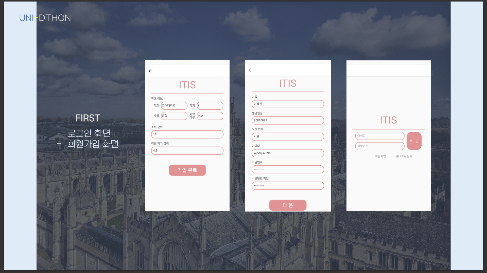
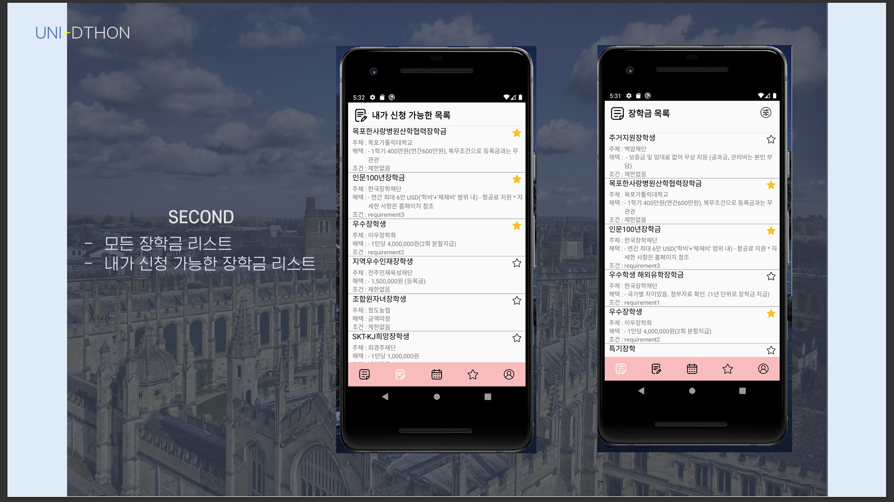

# 🎓 대학생 맞춤형 장학금 추천 서비스 (UNI-DTHON 금상 수상작)
> **Personalized Scholarship Recommendation App for University Students**

 
 

## 📌 1. Project Overview (프로젝트 개요)
수많은 장학금 정보가 산재해 있어 몰라서 못 받는 장학금이 많다는 문제에서 출발했습니다.
본 프로젝트는 **전국 장학금 데이터를 수집 및 DB화**하고, 사용자의 개인 정보(학점, 소득분위, 거주지 등)를 기반으로 **신청 가능한 장학금을 자동으로 필터링하여 추천**해주는 모바일 애플리케이션 프로토타입입니다.

* **기간:** 2021.11.05 ~ 2021.11.07 (UNI-DTHON 해커톤 프로젝트)
* **성과:** **UNI-DTHON 해커톤 금상 (2등)** 수상
* **역할:** 장학금 데이터 크롤링 및 전처리, 앱 UI/UX 디자인

---

## 🧐 2. Problem & Solution (문제 해결)
### ❌ Problem: 정보의 비대칭성
* 장학금 정보가 학교 홈페이지, 지자체, 재단별로 흩어져 있음.
* 자격 요건(학점 3.5 이상, 경기도 거주 등)이 복잡하여 일일이 확인하기 어려움.

### ⭕ Solution: 맞춤형 추천 알고리즘
* **Data Aggregation:** 흩어진 공고를 하나의 포맷(CSV/DB)으로 통합.
* **Smart Filtering:** 사용자 프로필(User Profile)과 공고의 자격 요건(Requirements)을 매칭하여 '지원 가능' 리스트만 도출.

---

## 💾 3. Data Pipeline & Processing (데이터 처리)

장학금 공고마다 제각각인 데이터 형식을 통일하기 위해 전처리 파이프라인을 구축했습니다.

### 3.1. Data Structure
수집된 비정형 텍스트 데이터를 분석 가능한 정형 데이터(Structured Data)로 변환했습니다.

| Organization | Min GPA | Income Level | Grant | Deadline | Number of candidates |
| :--- | :---: | :---: | :--- | :--- | :--- |
| OO장학재단 | 3.5 | 8구간 이하 | 1인당 400만원 | 2021-12-31 | 12명 |
| XX기업장학금 | - | 무관 | 학기당 150만원 | 2022-01-15 | 0명 |

### 3.2. Preprocessing Logic
* **결측치 처리:** 성적, 소득 기준이 없는 경우 `제한없음`으로 표준화하여 필터링 로직에서 제외되지 않도록 처리.
* **자격 요건 파싱(Parsing):** "평점 3.0 이상, 4.0 만점 기준" 등의 자연어 텍스트를 `min_gpa: 3.0`, `scale: 4.0` 수치형 데이터로 변환.
* **카테고리화:** 소득 분위, 지역 조건 등을 범주형 데이터(Categorical Data)로 매핑.

---

## 📱 4. Key Features & UI (주요 기능)

1.  **마이 페이지 (프로필 설정):** 내 학교, 학점, 거주지, 소득분위 입력.
2.  **전체 장학금 리스트:** DB에 적재된 모든 장학금을 마감일 순으로 조회.
3.  **맞춤 추천 (Smart Match):** 입력된 정보를 바탕으로 **지원 가능한 공고**만 필터링하여 노출.
    > *Logic: (User.GPA >= Scholarship.Min_GPA) AND (User.Loc IN Scholarship.Target_Loc)*

---

## 🛠 5. Retrospective (회고)

* **데이터 구조화의 중요성:** 제각각인 공고문을 하나의 스키마(Schema)로 정의하는 과정에서 데이터 모델링의 중요성을 배웠습니다.
* **사용자 관점:** 단순히 리스트만 보여주는 것이 아니라, '왜 추천되었는지' 이유를 함께 보여주는 UI를 기획하여 UX를 개선했습니다.

---

## 📂 Repository Structure
* `/data` : 전처리된 장학금 데이터 샘플 (Sample CSV)
* `/assets` : 앱 구동 화면 및 시연 영상, 발표 자료 (PPT)

## ⚙️ Others
`본 프로젝트는 대회 규정(혹은 팀 정책)상 소스코드는 공개하지 않으며, 연구 방법론과 성과 위주로 기술했습니다.`

`장학금 정보 데이터는 한국장학재단 API를 사용했습니다.`
